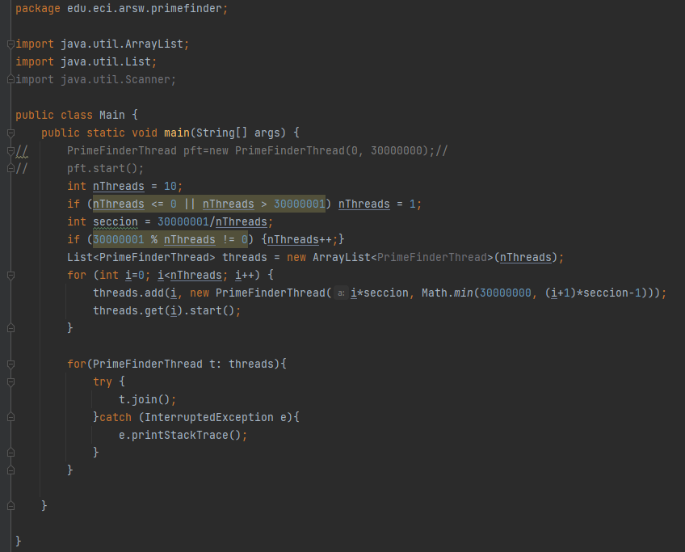

# *ARSW - Laboratorio 2*
# Programación concurrente, condiciones de carrera, esquemas de sincronización, colecciones sincronizadas y concurrentes.
## Integrantes:

- Crhystian Molano
- Juan Caceres

## *Descripción* 
Este ejercicio tiene como fin que el estudiante conozca y aplique conceptos propios de la programación concurrente en el caso de Dogs Race.

## *PARTE I*
Creación, puesta en marcha y coordinación de hilos.

1. Revise el programa “primos concurrentes” (en la carpeta parte1), dispuesto en el paquete edu.eci.arsw.primefinder. Este es un programa que calcula los números primos entre dos intervalos, distribuyendo la búsqueda de los mismos entre hilos independientes. Por ahora, tiene un único hilo de ejecución que busca los primos entre 0 y 30.000.000. Ejecútelo, abra el administrador de procesos del sistema operativo, y verifique cuantos núcleos son usados por el mismo.

EL programa utiliza un maximo de 2 nucleos para la ejecucion. 

 

2. Modifique el programa para que, en lugar de resolver el problema con un solo hilo, lo haga con tres, donde cada uno de éstos hará la tarcera parte del problema original. Verifique nuevamente el funcionamiento, y nuevamente revise el uso de los núcleos del equipo.

- Se realizó la modificación incluyendo casos de borde.

 

3. Lo que se le ha pedido es: debe modificar la aplicación de manera que cuando hayan transcurrido 5 segundos desde que se inició la ejecución, se detengan todos los hilos y se muestre el número de primos encontrados hasta el momento. Luego, se debe esperar a que el usuario presione ENTER para reanudar la ejecución de los mismo.

- Para detener un hilo en Java se utiliza su método 'stop()', pero está deprecado (al menos desde java 11)

 

## *PARTE II*

En esta parte, se puede observar la ejecución de un sistema multihilo que depende únicamente del *scheduler* del procesador.
El sistema presenta fallas de sincronización, haciendo que el hilo "principal" termine antes que los demás. 

 

## *PARTE III*

1. Se corrigió el hilo principal utlizando un `join()` por cada hilo (galgo) que se creara. Esto hizo que el hilo principal tuviera que esperar a que los demás terminaran.
2. Se presentan errores cuando e maneja la memoria compartida accesible desde la clase `RegistroLlegada`. Como no hay sincronización, cada hilo puede obtener y escribir datos erróneos.

 

* Las zonas críticas del programa están en la clase `RegistroLlegada`, ya que es en está clase donde esta la memoria compartida de los hilos, y en el código de cada hilo en la clase `Galgo`.

3. Para solucionar este problema y debido a como está diseñado la estructura del programa, se utilizó un bloque de código sincronizado para aislar la zona crítica.

 

 

4.Integramos los metodos parar y renaudar.

Se modifico listeners de las acciones de parar y renaudar.

 

creamos los metodos parar() y renaudar().

 

Por ultimo implementamos wait().

